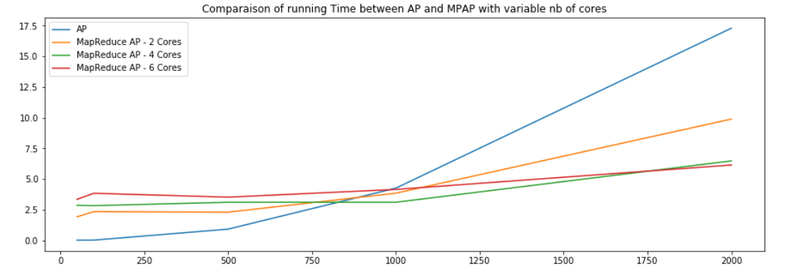
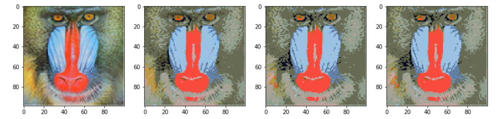

# Affinity-Propagation-MapReduce
Affinity Propagation and Hierarchical Affinity Propagation implementations with MapReduce as part of the 3rd year course *Elements Logiciels et Traitement des Données Massives* at the ENSAE ParisTech.

In this GitHub, we will implement two differents algorithms of Affinity Propagation : 
- Fist of all, a Map Reduce version of the standard affinity propagation based on the paper *Map/Reduce Affinity Propagation Clustering Algorithm* by Wei-Chih Hung *et al*, and we will measure stability and run time compared to the existing version of the affinity propagation algorithm (not parallelized) of Scikit Learn

- Secondly, we will implement both the Hierarchical Affinity Propagation algorithm as well as its Map Reduced version using the strategies proposed in the paper *Parallel Hierarchical Affinity Propagation with MapReduce* by Dillon Mark Rose *et al*. This will lead to a small clustering experimentation on images.

Here are some teaser :

### Run Time comparaison between the standard and map reduce version of the affinity propagation algo

### Color Clustering on the picture of a Mandrill

